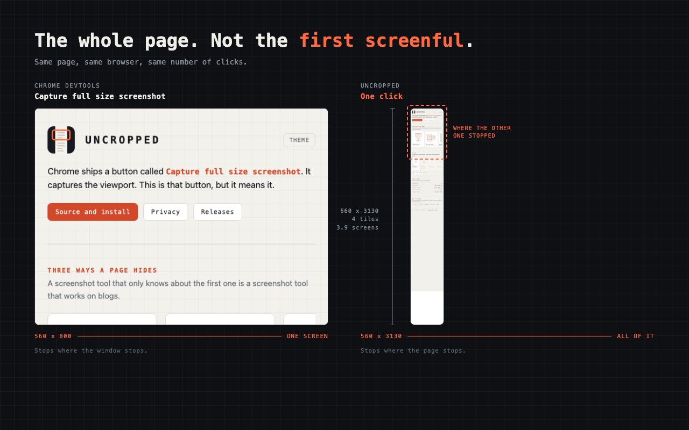
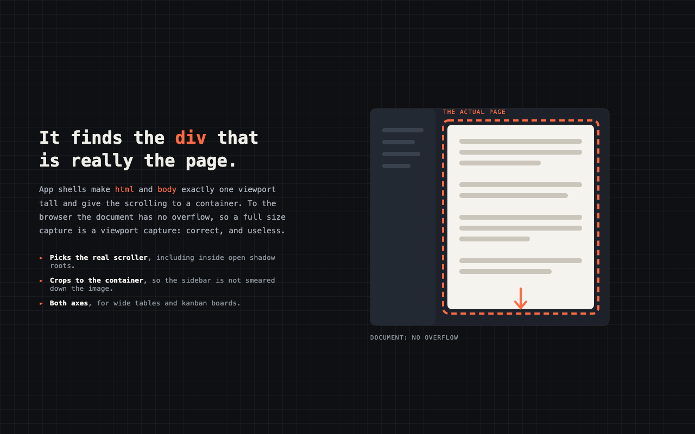

# Uncropped

**Screenshots the whole page.** Below the fold, off to the right, and inside the
scrolling `div` your browser calls the whole page.

Chrome already ships a button called *Capture full size screenshot*. It lives in
the DevTools command menu, and on a plain document it works. On an app shell,
where `html` and `body` are exactly one viewport tall and a container does the
scrolling, the document has no overflow, so a full size capture is a viewport
capture: correct, and useless. Uncropped is that button, but it means it.



## Install

Available on the [Chrome Web Store](https://chromewebstore.google.com/detail/jbmldbdipagojpopeadahbnbeidiiiej). Or load it from source, on Chrome 116 or newer:

1. `git clone https://github.com/john-athan/uncropped`
2. Open `chrome://extensions`, turn on **Developer mode**
3. **Load unpacked**, and pick the repo folder
4. Pin the toolbar icon, or use <kbd>Cmd</kbd>+<kbd>Shift</kbd>+<kbd>Y</kbd>

The image lands in `Downloads/Uncropped/`.

## What it does that the built in one does not

| | DevTools | Uncropped |
|---|---|---|
| Document taller than the window | yes | yes |
| Document wider than the window | yes | yes |
| Scrolling container inside the page | no | yes |
| Lazy images below the fold | whatever had loaded | warmed up first |
| Fixed toolbar repeated down the image | yes, it repeats | hidden after tile one |
| Output over the canvas ceiling | fails | scales down, and says so |



## How it works

```
action click
  -> inject content.js                 activeTab, granted by the click
  -> warm up: one pass down the page   lazy images and virtual rows appear
  -> measure: find the real scroller   document first, then the biggest scrollable box
  -> plan: cut into viewport tiles     last tile in each axis clamps and overlaps
  -> per tile: park, settle, capture   chrome.tabs.captureVisibleTab
  -> stitch in an offscreen document   drawn at true scroll offsets, times DPR
  -> restore the page, write the file
```

Three files do the work. `content.js` is the page side and is the only part that
touches your page. `background.js` is the service worker and drives the run.
`offscreen.js` owns the canvas, because a service worker has `OffscreenCanvas`
but no `URL.createObjectURL`, and the downloads API wants a URL.

Two details are load bearing. Tiles are drawn at the scroll offset they were
**actually** taken at, read back after the scroll rather than assumed, which is
what removes the seam where the last tile clamps against the end of the page.
And the capture interval adapts: Chrome rate limits `captureVisibleTab`, so
rather than pay the documented worst case on every tile, Uncropped starts fast,
backs off when the browser complains, and creeps back up when it stops.

## Limits, stated

| | |
|---|---|
| Longest side | 16384 px, a hard browser limit on canvas geometry |
| Area ceiling | 120 MP by default, then the output scales down and reports the factor |
| Capture interval | 120 to 950 ms, adaptive |
| Cross origin iframes | photographed as rendered, not expanded. Neither can DevTools |
| `chrome://` pages | refused by the browser, not by the extension |
| Closed shadow roots | invisible to the scroller search, as they are to everything else |

## Permissions

`activeTab` `scripting` `downloads` `offscreen` `storage`

No host permissions, so it cannot run on a page you have not clicked it on. No
network calls, no analytics, no account, no bundled libraries. Full reasoning in
[docs/privacy-policy.html](docs/privacy-policy.html).

## Rejected alternatives

**`chrome.debugger` with `Page.captureScreenshot` and `captureBeyondViewport`.**
This is what DevTools itself uses, it needs no stitching, and it is faster. It
also raises a yellow *Uncropped started debugging this browser* bar across the
top of the window for as long as it runs, cannot attach while DevTools is open,
and asks a reviewer to approve the single most powerful permission in the
platform so that somebody can take a picture. Not worth it.

**A bundled stitcher.** There is no dependency in this repo and there is not
going to be one. Everything here is the platform.

## Building it

Every binary in the repo is generated from a source in `meta/`, and the store
upload is generated from the tracked files:

```sh
tools/package.sh                # the store zip, then check it against the store
tools/render-assets.sh          # icons, promo tiles, store screenshots
tools/render-assets.sh icons    # just icons/
```

`package.sh` ships the extension and nothing else, then hands the zip to
`scripts/check-package.mjs`, which refuses a package that exceeds a store field
limit, names a file it did not pack, carries anything but the extension, or
contains an `eval`, a network call or an HTML injection that the listing says
it does not. Submission itself is a runbook: [meta/PUBLISHING.md](meta/PUBLISHING.md).

The renderer is Chrome itself, which is already installed, already colour
manages the way the store will, and keeps an image library out of the
dependency list. Icons come from `meta/icon.svg`, with a simplified master for
16 and 32 px, where the page furniture turns to mud.

## Testing

Three page shapes, because they fail in different ways. Open
`tests/pages/index.html` from disk and capture each one:

| | What it is | What a correct capture looks like |
|---|---|---|
| `article.html` | Document scrolls, sticky header, lazy images | Tall image, header once at the top, no blank image boxes |
| `app-shell.html` | `html` and `body` are one viewport tall, a `div` scrolls | Tall image of the panel only, sidebar not repeated down the side |
| `wide-table.html` | Wider and taller than the window | One wide tall image, cells labelled `row.column` so a seam or a skip is readable |

The second one is the case the built in capture gets wrong, and the one worth
re-running after any change to the scroller search.

## Provenance

The check for whether new code also lives in somebody else's repository is not
a script in this tree. It was identical across seven repositories, so it now
runs once from oss-kit, before a release is tagged rather than after. See
[THIRD_PARTY.md](THIRD_PARTY.md) for what past runs found.

## Contributing, and reporting a hole

[CONTRIBUTING.md](CONTRIBUTING.md) says how to run it, what to capture before
opening a pull request, and the three constraints a change should not break.
[SECURITY.md](SECURITY.md) says what counts as a security bug here and where to
send one privately.

## License

MIT. See [LICENSE](LICENSE).
